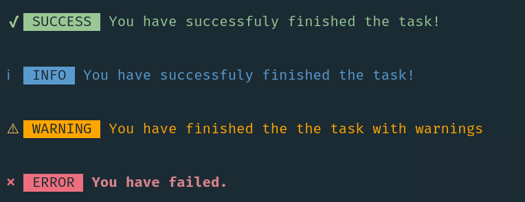

<h4 align="center">
    <a href="https://github.com/thebestdon/cli-alerts">
        
    </a>
    <br>
    <br>

Cross platform CLI Alerts with colors & colored symbols for success, info, warning, error.
<br>
Work on macOS, Linux, and Windows.
</h4>

<br>

# cli-alerts

[](./../../)

## Install

```sh
npm install cli-alerts
```

<br>

[](./../../)

## Usage

```js
const alert = require('cli-alerts');

// Provide the type, msg, and name options.
alert({type: `success`, msg: `Everything finished!`});
// Prints: ✔ SUCCESS Everything finished!

alert({type: `success`, msg: `Everything finished!`, name: `DONE`});
// Prints: ✔ DONE Everything finished!

alert({type: `warning`, msg: `You didn't add something!`});
// Prints: ⚠ WARNING You didn't add something!

alert({type: `info`, msg: `Awais is awesome!`});
// Prints: ℹ INFO Awais is awesome!

alert({type: `error`, msg: `Something went wrong!`});
// Prints: ✖ ERROR Something went wrong!
```

<br />

[](./../../)

## API

### alert(options)

#### ❯ options

Type: `object`<br>
Default: `{}`

You can specify the options below.

##### ❯ type

Type: `string`<br>
Default: `error`

##### ❯ msg

Type: `string`<br>
Default: `You forgot to define all options.` (Error message)

##### ❯ name

Type: `string`<br>
Default: `''` (Empty string)

<br>

## License & Conduct

- MIT © [Donatas Bakanas](https://twitter.com/donas04/)
- [Code of Conduct](code-of-conduct.md)

<br>
